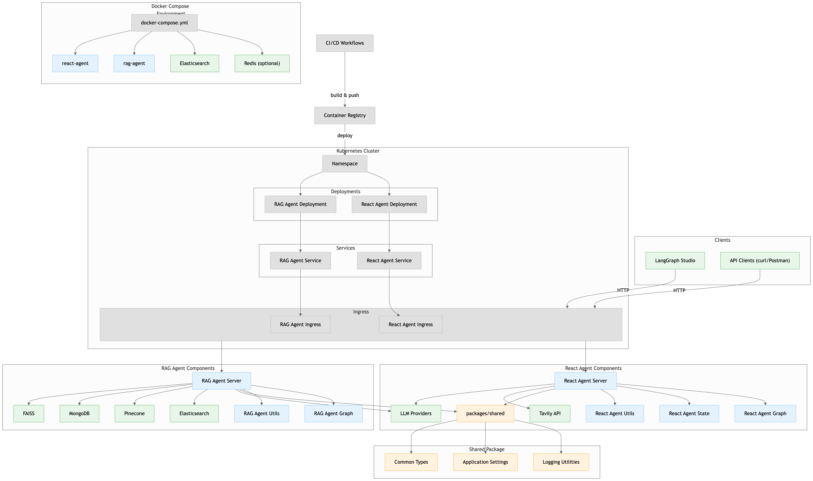

# LangGraph Agent Templates

A comprehensive, production-ready template repository for building LangGraph-based AI agents. This repository provides two main agent implementations:

- **React Agent** - ReAct (Reasoning and Acting) pattern agent with web search capabilities
- **RAG Agent** - Retrieval-Augmented Generation agent with multi-graph architecture

Both agents are built using the official LangGraph templates and adapted for production deployment with Docker, Kubernetes, and CI/CD support.

## 🚀 Quick Start

### Prerequisites

- Python 3.12+
- [uv](https://github.com/astral-sh/uv) (recommended) or pip
- Docker (optional)
- Kubernetes (optional)

### Local Development

1. **Clone the repository:**
```bash
git clone <your-repo-url>
cd langgraph-agent-templates
```

2. **Install workspace dependencies:**
```bash
uv sync
```

3. **Set up environment variables:**
```bash
cp .env.example .env
# Edit .env with your API keys
```

4. **Run agents locally:**

**React Agent:**
```bash
cd apps/react_agent
uvicorn react_agent.server:app --reload --port 2024
```

**RAG Agent:**
```bash  
cd apps/rag_agent
uvicorn rag_agent.server:app --reload --port 2025
```

### LangGraph Studio

1. Install [LangGraph Studio](https://studio.langchain.com/)
2. Connect to your local agents:
   - React Agent: `http://localhost:2024`
   - RAG Agent: `http://localhost:2025`
3. Start building and debugging your agents visually

## 📁 Project Structure

```
langgraph-agent-templates/
├── README.md                 # This file
├── LICENSE                   # MIT License
├── .gitignore               # Git ignore rules
├── .env.example             # Environment template
├── pyproject.toml           # Workspace configuration
├── docker-compose.yml       # Multi-service Docker setup
│
├── packages/shared/         # Shared utilities
│   ├── src/shared/
│   │   ├── logging.py       # Structured logging
│   │   ├── settings.py      # Pydantic settings
│   │   └── types.py         # Common type definitions
│   └── pyproject.toml
│
├── apps/
│   ├── react_agent/         # ReAct pattern agent
│   │   ├── src/react_agent/
│   │   │   ├── graph.py     # Core graph definition
│   │   │   ├── server.py    # FastAPI server
│   │   │   ├── state.py     # State definitions
│   │   │   └── utils/       # Node implementations
│   │   ├── tests/           # Agent tests
│   │   ├── Dockerfile       # Container image
│   │   ├── langgraph.json   # LangGraph config
│   │   └── README.md        # Agent-specific docs
│   │
│   └── rag_agent/           # RAG pattern agent
│       ├── src/rag_agent/
│       │   ├── graph.py     # Multi-graph definitions
│       │   ├── server.py    # FastAPI server
│       │   ├── utils/       # RAG implementations
│       │   └── sample_docs.json # Sample documents
│       ├── tests/           # Agent tests
│       ├── Dockerfile       # Container image
│       ├── langgraph.json   # LangGraph config
│       └── README.md        # Agent-specific docs
│
├── k8s/                     # Kubernetes manifests
│   ├── namespace.yaml       # Shared namespace
│   ├── react-agent/         # React agent K8s resources
│   └── rag-agent/           # RAG agent K8s resources
│
└── .github/workflows/       # CI/CD pipelines
    └── ci.yml              # Automated testing & deployment
```

## 🏗️ Architecture



The architecture shows the complete deployment pipeline from Docker Compose environment through CI/CD workflows to Kubernetes cluster deployment. Both React and RAG agents share common infrastructure while maintaining their specific components and dependencies.

## 🤖 Agent Overview

### React Agent

A ReAct (Reasoning and Acting) pattern agent that iteratively:
1. **Thinks** about the user's query
2. **Acts** by calling tools (web search, etc.)
3. **Observes** the results
4. **Repeats** until the task is complete

**Key Features:**
- Web search with Tavily
- Multiple LLM support (Claude, GPT-4, etc.)
- Extensible tool system
- Real-time debugging in LangGraph Studio

### RAG Agent

A sophisticated Retrieval-Augmented Generation agent with:
1. **Document Indexing** - Process and store documents in vector databases
2. **Query Analysis** - Smart routing based on query type
3. **Research Planning** - Break down complex queries into steps
4. **Retrieval & Response** - Generate contextual answers

**Key Features:**
- Multi-vector store support (Elasticsearch, Pinecone, MongoDB, FAISS)
- Multi-graph architecture (indexing, retrieval, research)
- Intelligent query routing
- Research planning for complex queries

## 🛠️ Configuration

### Environment Variables

Create a `.env` file from `.env.example`:

```bash
# LLM Configuration
OPENAI_API_KEY=your-openai-api-key
ANTHROPIC_API_KEY=your-anthropic-api-key

# Tool APIs
TAVILY_API_KEY=your-tavily-api-key

# Vector Stores (for RAG agent)
ELASTICSEARCH_URL=http://localhost:9200
PINECONE_API_KEY=your-pinecone-api-key
MONGODB_ATLAS_URI=your-mongodb-uri

# LangSmith (optional)
LANGCHAIN_TRACING_V2=true
LANGCHAIN_API_KEY=your-langsmith-key
```

### Model Configuration

Both agents support multiple LLM providers:

```bash
# Anthropic Claude (default)
MODEL=anthropic/claude-3-5-sonnet-20240620

# OpenAI GPT-4
MODEL=openai/gpt-4o

# Fireworks
MODEL=fireworks/accounts/fireworks/models/llama-v3p1-405b-instruct
```

## 🐳 Docker Deployment

### Docker Compose (Recommended)

Run both agents with all dependencies:

```bash
# Basic setup
docker-compose up --build

# With Elasticsearch for RAG
docker-compose --profile elasticsearch up --build

# With Redis for caching
docker-compose --profile redis up --build
```

Services will be available at:
- React Agent: http://localhost:2024
- RAG Agent: http://localhost:2025
- Elasticsearch: http://localhost:9200 (if enabled)

### Individual Containers

Build and run agents separately:

```bash
# React Agent
cd apps/react_agent
docker build -t react-agent .
docker run -p 2024:2024 --env-file .env react-agent

# RAG Agent  
cd apps/rag_agent
docker build -t rag-agent .
docker run -p 2025:2025 --env-file .env rag-agent
```

## ☸️ Kubernetes Deployment

### Prerequisites

- Kubernetes cluster
- kubectl configured
- Container images pushed to registry

### Deploy to Kubernetes

1. **Create namespace and secrets:**
```bash
kubectl apply -f k8s/namespace.yaml

# Create secrets (replace with your values)
kubectl create secret generic react-agent-secrets \
  --namespace=langgraph-agents \
  --from-literal=OPENAI_API_KEY=your-key \
  --from-literal=TAVILY_API_KEY=your-key

kubectl create secret generic rag-agent-secrets \
  --namespace=langgraph-agents \
  --from-literal=OPENAI_API_KEY=your-key \
  --from-literal=ELASTICSEARCH_URL=your-url
```

2. **Deploy agents:**
```bash
# Deploy React Agent
kubectl apply -f k8s/react-agent/

# Deploy RAG Agent
kubectl apply -f k8s/rag-agent/
```

3. **Access agents:**
```bash
# Port forward to access locally
kubectl port-forward -n langgraph-agents service/react-agent 2024:80
kubectl port-forward -n langgraph-agents service/rag-agent 2025:80

# Or configure ingress for external access
```

## 🧪 Development & Testing

### Running Tests

```bash
# Test all apps
uv run pytest

# Test specific app
cd apps/react_agent
uv run pytest tests/

# Test with coverage
uv run pytest --cov=src tests/
```

### Code Quality

```bash
# Linting
uv run ruff check src/ tests/

# Type checking
uv run mypy src/

# Formatting
uv run ruff format src/ tests/
```

## 🔧 Extending the Agents

### Adding New Tools

1. **Create tool function:**
```python
# In apps/react_agent/src/react_agent/utils/tools.py
async def my_custom_tool(input: str) -> str:
    \"\"\"Your custom tool implementation.\"\"\"
    # Implementation here
    return result

# Add to TOOLS list
TOOLS.append(my_custom_tool)
```

2. **Tool will be automatically available to the agent**

### Adding New Vector Stores

1. **Extend the vector store loader:**
```python
# In apps/rag_agent/src/rag_agent/utils/tools.py
def load_vector_store(store_type: str, embeddings: Embeddings, **kwargs):
    if store_type == "my_new_store":
        from my_vector_store import MyVectorStore
        return MyVectorStore(embedding=embeddings, **kwargs)
```

### Customizing Prompts

Modify prompts in the respective `utils/prompts.py` files:

```python
SYSTEM_PROMPT = \"\"\"Your custom system prompt here...\"\"\"
```

## 📚 Learning Resources

### Official Documentation

- [LangGraph Documentation](https://langchain-ai.github.io/langgraph/)
- [LangGraph Studio](https://langchain-ai.github.io/langgraph/concepts/langgraph_studio/)
- [Official React Agent Template](https://github.com/langchain-ai/react-agent)
- [Official RAG Research Agent Template](https://github.com/langchain-ai/rag-research-agent-template)

### Key Concepts

- [LangGraph Concepts](https://langchain-ai.github.io/langgraph/concepts/)
- [State Management](https://langchain-ai.github.io/langgraph/concepts/low_level/#state)
- [Graph Architecture](https://langchain-ai.github.io/langgraph/concepts/low_level/#graphs)
- [ReAct Pattern](https://arxiv.org/abs/2210.03629)

## 🤝 Contributing

1. Fork the repository
2. Create a feature branch: `git checkout -b feature/amazing-feature`
3. Make your changes and add tests
4. Ensure all tests pass: `uv run pytest`
5. Commit your changes: `git commit -m 'Add amazing feature'`
6. Push to the branch: `git push origin feature/amazing-feature`
7. Open a Pull Request

## 📄 License

This project is licensed under the MIT License - see the [LICENSE](LICENSE) file for details.

## 🆘 Support

- **Documentation**: Check the individual agent READMEs in `apps/*/README.md`
- **Issues**: Open an issue on GitHub
- **Discussions**: Use GitHub Discussions for questions
- **LangGraph Support**: Visit [LangGraph documentation](https://langchain-ai.github.io/langgraph/)

## 🎉 Acknowledgments

- Built using [LangGraph](https://github.com/langchain-ai/langgraph) by LangChain
- Based on official LangGraph agent templates
- Inspired by the ReAct paper and RAG research
- Thanks to the LangChain community

---

**Ready to build amazing AI agents?** Start with our templates and customize them for your needs! 🚀